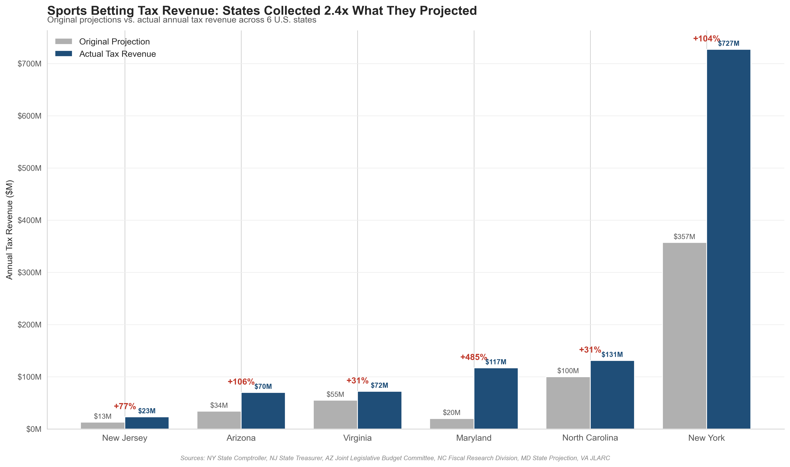
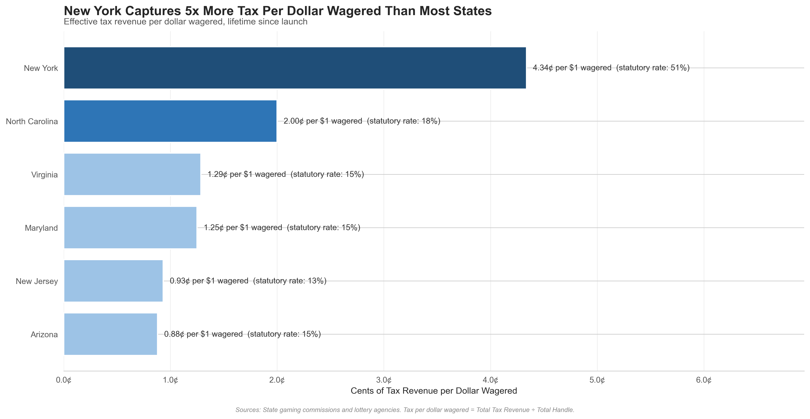
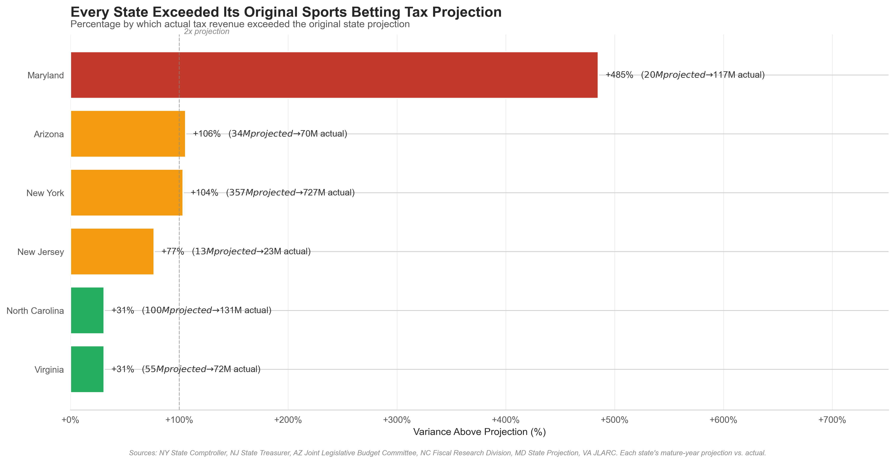

# Sports Betting Legalization: Did States Get the Tax Revenue They Were Promised?

An analysis of original tax revenue projections versus actual collections across 6 U.S. states that legalized sports betting between 2018 and 2024.

## TL;DR

**Across all 6 states, sports betting tax revenue exceeded original projections by an average of +138.9% — meaning states collected approximately 2.4x what they originally projected.** Every single state in the analysis exceeded its projection. The variance ranged from +30.9% (Virginia) to +485% (Maryland).

## The Question

When U.S. states debated legalizing sports betting, legislators justified the policy partly by promising significant tax revenue. State fiscal notes, comptroller reports, and budget projections estimated specific dollar amounts each state would collect.

This analysis asks a simple question: **did the projections hold up?**

## The Data

The analysis covers 6 states selected for variety in launch timing, tax rate structure, and market size:

| State | Launch | Tax Rate | Original Projection | Actual Tax Revenue |
|---|---|---|---|---|
| New York | Jan 2022 | 51% | $357M (FY 2022-23) | $727M |
| New Jersey | Aug 2018 | 13% | $13M (FY 2019) | $23M |
| Arizona | Sep 2021 | 15% | $34M (FY 2024) | ~$70M |
| North Carolina | Mar 2024 | 18% | $100M (Year 4 target) | $131M (Year 1) |
| Maryland | Nov 2022 | 15% | $20M (mature year) | ~$117M |
| Virginia | Jan 2021 | 15% | $55M (mature year) | $72M |

## Key Findings

### 1. Every state exceeded its projection
Average variance across the 6 states was **+138.9%**. The directional finding is robust — even accounting for different projection vintages and methodologies, every state collected significantly more than originally forecast.

### 2. Maryland's projection was the most inaccurate (+485%)
Maryland's official Question 2 referendum projected ~$20M annually in mature-year tax revenue. Actual collections reached ~$117M — nearly 6x the original estimate. The projection was made in 2020, before mobile betting's full impact was understood.

### 3. North Carolina's Year-1 revenue exceeded its Year-4 projection
NC's General Assembly Fiscal Research Division projected ~$100M in tax revenue by FY 2027-28 (Year 4 of operation). NC reached $131M in Year 1 alone — a striking forecasting failure that highlights how quickly mobile-driven markets ramp.

### 4. Virginia and North Carolina projected most accurately (+31%)
The most recent projections were the most realistic. States that legalized later could calibrate against actual data from earlier-legalizing states. Virginia's JLARC and North Carolina's Fiscal Research Division both used live data from New Jersey and Pennsylvania to ground their estimates.

### 5. Tax rate dramatically affects state capture
New York's 51% statutory rate translates to approximately 4.3 cents of tax revenue per dollar wagered — roughly 5x what New Jersey collects (0.93 cents) despite NJ having a comparable handle volume. New York alone accounts for 63.8% of combined annual tax revenue across the 6 states.

## Combined Scale (Lifetime Since Launch)

- **$227.5 billion** total wagered across these 6 states
- **$19.2 billion** kept by sportsbooks as revenue
- **$5.24 billion** collected by states in tax revenue

## Methodology

Projections were sourced from **primary government documents**:

- **New York:** NY State Comptroller (DiNapoli Report) and NY Division of the Budget
- **New Jersey:** NJ State Treasurer Elizabeth Muoio (May 2018 forecast)
- **Arizona:** AZ Joint Legislative Budget Committee (Senate Fiscal Note for HB 2772)
- **North Carolina:** NC General Assembly Fiscal Research Division (HB 347 fiscal note)
- **Maryland:** MD Official State Projection (Question 2 Referendum, 2020)
- **Virginia:** VA Joint Legislative Audit and Review Commission (2019 study)

Actuals were sourced from state gaming commissions and lottery agencies, cross-referenced against the Tax Foundation, U.S. Census Bureau, and Legal Sports Report.

## Limitations

- Projections were made at different points in each state's legalization process. Some compared first-year actuals to first-year projections; others compared early-period actuals to "mature year" projections. The directional finding is robust to this variation, but precise variance figures should be interpreted with this in mind.
- Two states (Arizona, Maryland) have actuals derived from approximation. Primary-source verification is recommended for final publication.
- Analysis does not adjust for inflation between projection date and actual date.

## Implications

The systematic underestimation of sports betting tax revenue across all six states suggests that **pre-launch fiscal projections likely underestimate revenue potential**, particularly when projections are made before mobile betting's adoption pattern is established in comparable markets. States considering legalization can use this finding to inform expectations, and budget cycles in legalized states should expect upside surprises in the early years post-launch.

## Repository Structure

- `README.md` — Project overview and findings
- `SportsBetting.ipynb` — Full analysis notebook
- `sports_betting_actuals_v2.xlsx` — Raw actuals data
- `sports_betting_projections_v2.xlsx` — Original projections data
- `images/` — Chart images embedded in this README

## Tools Used

- **Python** (pandas, matplotlib, seaborn) for analysis and visualization
- **Excel** for initial data structuring and source documentation
- **Jupyter Notebook** for the analysis workflow

## About This Project

This analysis was completed as a portfolio project to demonstrate end-to-end analytical workflow: identifying a research question, sourcing data from primary government documents, structuring and cleaning data, conducting analysis, building visualizations, and communicating findings.

Feedback and corrections are welcome via the issues tab.
